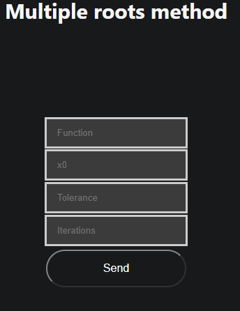

# Multiple Roots

Welcome to help section of Multiple roots explore how to use this method and what information you need to use it

## How to use it

To use this method you need these parameters

- Function to evaluate
- $X_0$: start point
- Tolerance: to find the value with an error less than delta
- Iterations: or maximum iteration that your need to execute this method

[How to write a function](../../team/equations)

### Example 

-   Function $f(x)$: x^3-x^2-2*x+2+sin(x-1)
-   $X_0$: 0.5
-   Delta: 0.005
-   Iterations: 500

## [Go to method](../../methods/raicesMult)