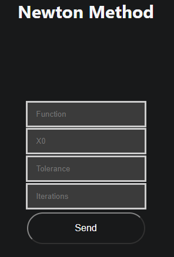

# Newton

Welcome to help section of Newton method explore how to use this method and what information you need to use it

## How to use it

To use this method you need these parameters

- Function to evaluate
- X0: start point
- Tolerance: to find the value with an error less than delta
- Iterations: or maximum iteration that your need to execute this method

[How to write a function](../../team/equations)

### Example 

-   Function: log(x ^ 2 - 2*x + 2)
-    X0: 0.5
-    Delta: 0.005
-    Iterations: 500

## [Go to method](../../methods/newton)