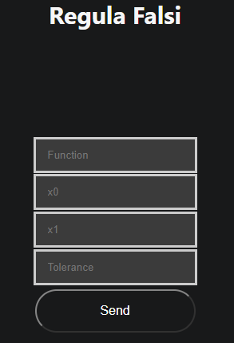

# Regula Falsi

Welcome to help section of Regula Falsi explore how to use this method and what information you need to use it

## How to use it

To use this method you need these parameters

- Function to evaluate
- $X_0$: Initial value of range
- $X_1$: Final value of range
- Tolerance: value with error lower or equal than tolerance

[How to write a function](../../team/equations)

### Example 

-   Function: x^3-5
-    $X_0$: 1.5
-    $X_1$: 1.75
-    Tolerance: 1e-5

## [Go to method](../../methods/reglaFalsa)