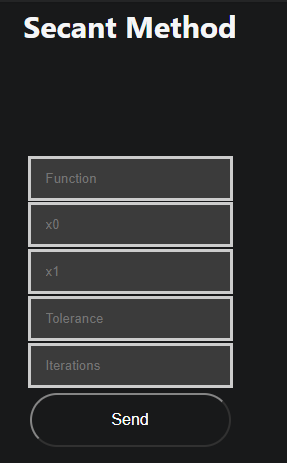

# Secant

Welcome to help section of Secant explore how to use this method and what information you need to use it

## How to use it

To use this method you need these parameters

- Function to evaluate
- $X_0$: Initial value of range
- $X_1$: Final value of range
- Tolerance: value with error lower or equal than tolerance
- Iterations: or maximum iteration that your need to execute this method

[How to write a function](../../team/equations)

### Example 

-   Function $f(x)$: x^5 - 5*x + 3
-   $X_1$: 0
-   $X_1$: 0.5
-   Tolerance: 1e-5
-   Iterations: 100

## [Go to method](../../methods/secante)