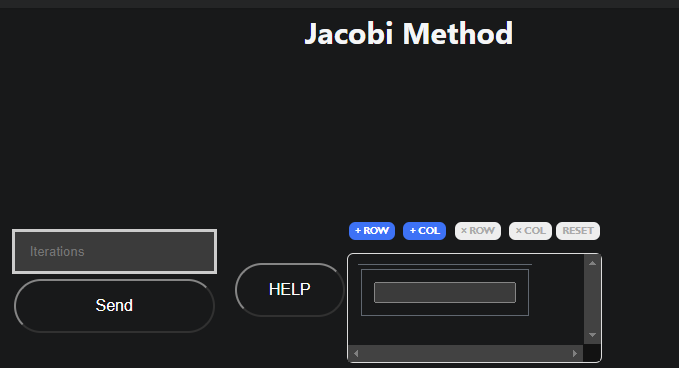

# Jacobi

Welcome to help section of Jacobi method explore how to use this method and what information you need to use it

## How to use it

To use this method you need these parameters

- Matrix: Need to be as Mx(M+1) the last column is for the independent vector x
- Iterations: or maximum iteration that your need to execute this method
### Example 

- Matrix:
$\begin{bmatrix}
    2 & 1 & | & 11 \\
    5 & 7 & | & 3 
\end{bmatrix}$

$\colorbox{red} {Required matrix expressed as extended matrix}$

- Iterations: 30

## [Go to method](../../methods/iteratives/jacobi)