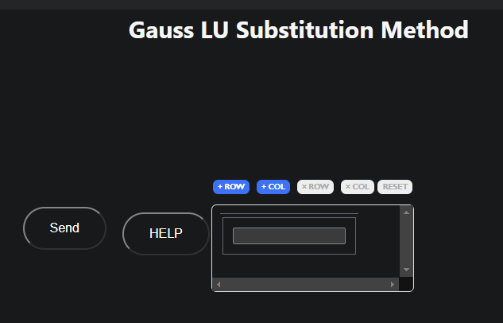

# Gaussian simple (LU)

Welcome to help section of Gaussian simple (LU) explore how to use this method and what information you need to use it

## How to use it

To use this method you need these parameters

- Matrix: Need to be as Mx(M+1) the last column is for the independent vector x

### Example 

$\begin{Bmatrix}
    x & 4y & -z & = & -5 \\
    x & y & -6z & = & -12 \\
    3x & y & -z & = & 4
\end{Bmatrix}$
$=$
$\begin{bmatrix}
    1 & 4 & -1 & | & -5 \\
    1 & 1 & -6 & | & -12 \\
    3 & 1 & -1 & | & 4
\end{bmatrix}$

$\colorbox{red} {Required matrix expressed as extended matrix}$

[Go to method](../../methods/matrix/gausslu)