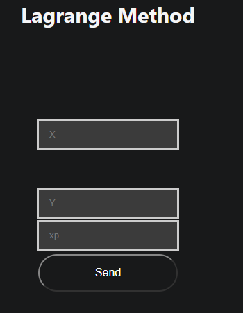

# Lagrange

Welcome to help section of Lagrange explore how to use this method and what information you need to use it

## How to use it

To use this method you need these parameters

- $X$: x coordinates
- $Y$: y coordinates
- $xp$: value to find

### Example 

-   $X$: 0,1,2,5
-   $Y$: 2,3,12,147
-   $x$p: 3

$\colorbox{red} {Express X and Y coordinates as values separated by a comma}$

## [Go to method](../../methods/interpolation/lagrange)